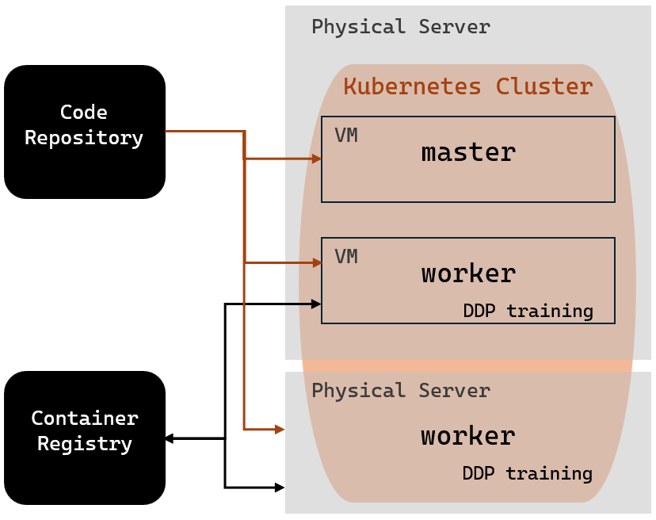
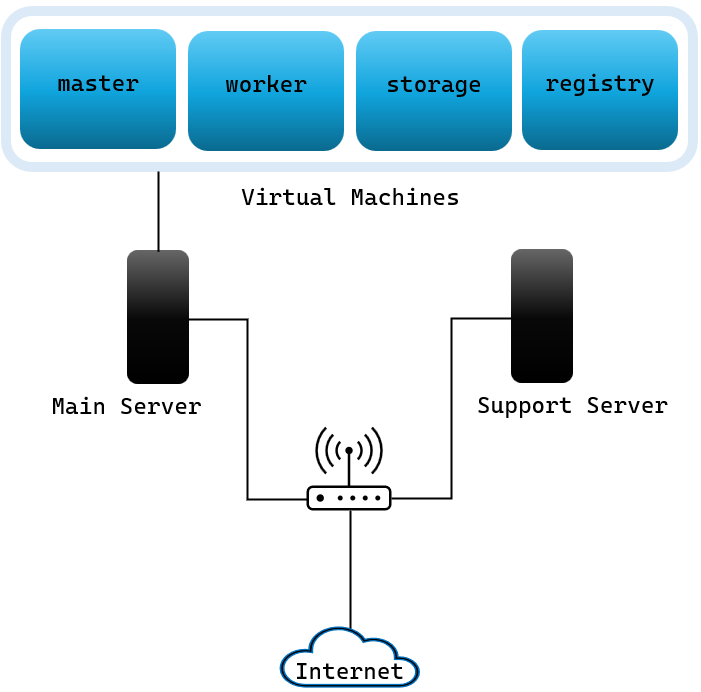

# MLOps

## Overview

This repository contains the results from the master thesis 
titled
["Automation and Orchestration for Machine Learning Pipelines, A Study of Machine Learning Scaling: Exploring Micro-service architecture with Kubernetes"](Thesis_Report.pdf)
and written by
by Filip Melberg and Vasiliki Kostara under supervision of Hamid Ebadi at Infotiv AB.


You will find scripts and documentation on how to set up a Kubernetes Control plane, worker nodes, local image registry and a simple storage server as well as how to add a dashboard, simple containerized training of the YOLOv5 model and distributed training with any model - all on the Kubernetes cluster.

OBS! The `.kube/` folder should always be moved to the home directory of the current device. It contains the config file that kubectl uses to access the Kubernetes cluster. The config file is automatically created each time you set up a control plane (inside `~/.kube/` on the control plane). If you are having issues with the kubectl command try updating the config file by copying the config from the control plane.  

## High Level Requirements:

1. Automated and Reproducible (by use of docker, scripts, config files)
1. Opensource/Free solution
1. Use of cluster for training and load balancing
1. Version controlling (code, data, model)

## High Level Design
For this thesis project, two different machine learning (ML) projects can be implemented. 
The first is object detection of forklifts and people.
The second is distributed data parallel (DDP) training, which introduces further functionality to the Kubernetes cluster.
The schematics below illustrate parts of the cluster that are active during each ML project.

#### [Object detection](./forkliftDetection/)


#### [DDP Training](./k8sDDPtrain/)


## Main Server

The main server is our primary desktop.
It hosts virtual machines including:

- Kubernetes master node
- Kubernetes worker node (optionally)
- storage (currently Samba but in future artifactory)
- container registry (unstable)


|             |                    |
| ----------- | ------------------ |
| DEVICE NAME | research           |
| USERNAME    | MAINSERVER         |
| PASSWORD    | REDACTED    |
|             |                    |
| OS NAME     | Ubuntu 22.04.3 LTS |
| OS TYPE     | 64-bit             |


### Virtual Machines

After consideration, we have decided to use [Oracle VM VirtualBox](https://www.virtualbox.org/), version 7.0.14 for Ubuntu 22.04.
Before creating the VM, we are running the following commands in the Ubuntu command window:

```
sudo apt-get update
sudo apt install virtualbox git virtualbox-guest-x11
sudo apt-get install build-essential gcc make perl dkms
reboot
```

On every VM we install [Ubuntu Server 22.04.4](https://releases.ubuntu.com/22.04.4/ubuntu-22.04.4-live-server-amd64.iso).
We are setting the following option:

```
Settings ⟶ Network ⟶ Attached to : Bridged Adapter
```

ATTENTION: The Kubernetes VMs need at least 2 CPUs.

ATTENTION: All VM disk spaces are allocated dynamically, except for the registry, which has fixed size.

| Name     | Password | Role                   | RAM (MB) | Disk (GB) | CPUs | Documentation                       | State      |
| -------- | -------- | ---------------------- | -------- | --------- | ---- | ----------------------------------- | ---------- |
| master   | REDACTED   | Kubernetes master node | 8192     | 40,00     | 4    | [Documentation](kubernetesSetup/)   | in use     |
| worker   | REDACTED   | Kubernetes worker node | 8192     | 40,00     | 2    | [Documentation](kubernetesSetup/)   | in use     |
| storage  | REDACTED  | SAMBA storage          | 8192     | 50,00     | 2    | [Documentation](storageSamba/)      | in use     |
| registry | REDACTED | container registry     | 11264    | 100,00    | 4    | [Documentation](containerRegistry/) | not in use |

## Support Server

The support server is a second desktop hosting a Kubernetes worker node.


|             |                    |
| ----------- | ------------------ |
| DEVICE NAME | research           |
| USERNAME    | research           |
| PASSWORD    | REDACTED    |
|             |                    |
| OS NAME     | Ubuntu 22.04.3 LTS |
| OS TYPE     | 64-bit             |

#### Shell Scripts

To make a shell script executable run:

```
chmod +x <fileName>.sh
```

### Networking



The cluster is placed in a separate network.

To connect through WiFi:

|          |             |
| -------- | ----------- |
| SSID     | `ASUS_F8`   |
| Password | `REDACTED` |

On your browser enter the address `192.168.10.1`.
The router has credentials:

|          |               |
| -------- | ------------- |
| Username | `admin`       |
| Password | `REDACTED` |

To add a new host, navigate to `Advanced Settings  ⟶ LAN  ⟶ DHCP Server`.
Firstly, under `Manual Assignment` choose `Yes` to `Enable Manual Assignment`.

The, under `Manually Assigned IP around the DHCP list (Max Limit : 64)` choose `Client Name (MAC Address)` from the list and set the `IP Address` manually. Press the "+" button under `Add / Delete` and select the `Apply` button at the end to confirm any changes.
The `MAC address` should be chosen according to the output of `ifconfig` under `ether` on your local terminal.

To securely log into a remote machine we need to enable `ssh` on it:

```
sudo apt install openssh-server
```

Now to `ssh` into any of the servers you can run:

```
ssh hostname@hostname
```

The network devices are configured so that:


- The WAN interface of the cluster has the IP address of 192.168.10.126

- The LAN (internal) IP address range is 192.168.10.1 / 255.255.255.0

  - Container registry VM : 192.168.10.60  >>> RESERVED FOR FUTURE (Artifactory supports container registry)
  - Storage artifactory VM  : 192.168.10.70  >>> RESERVED FOR FUTURE
  - Worker node VMs: 192.168.10.X where X >100

| Hostame    | Type            | Role                   | MAC address    |
| ---------- | --------------- | ---------------------- | -------------- |
| MAINSERVER | desktop         | main server            | 192.168.10.20  |
| research   | desktop         | support server         | 192.168.10.30  |
| storage    | virtual machine | SAMBA storage          | 192.168.10.40  |
| master     | virtual machine | Kubernetes master node | 192.168.10.50  |
| registry   | virtual machine | container registry     | 192.168.10.60  |
| worker     | virtual machine | Kubernetes worker node | 192.168.10.101 |

## Docker Hub as Container registry

We use Docker Hub but in future we can switch to internal docker registry:

|          |                                |
| -------- | ------------------------------ |
| EMAIL    | `vasiliki.kostara@infotiv.se ` |
| USERNAME | `vaskostara`                   |
| PASSWORD | `REDACTED `              |

Log in Docker Hub and create a repository (example name `my-repo` and tagname `0.0.1`). Then, run the following in your terminal:

```
sudo docker build -t vaskostara/my-repo:0.0.1 .
docker push vaskostara/my-repo:0.0.1
```

If the last command fails to push, run this before pushing again

```
docker login -u "vaskostara" -p "REDACTED" docker.io
```

## Credits

The research for this master thesis was carried out within the [SMILE IV project](https://www.vinnova.se/p/smile-iv/),
financed by Vinnova, FFI, Fordonsstrategisk forskning och innovation under the
grant number 2023-00789
